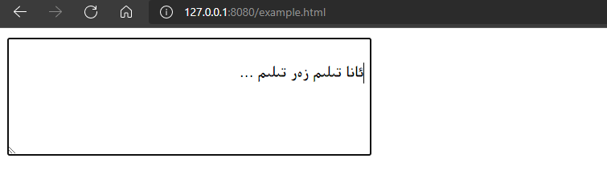

# uyghurche

### 0. describe

> this is a simple uyghur arabic input method for web , and it is changed based on qarluq uime. u can use this script to input uyghur abaric letters in your input boxes ...

### 1. installation

> just import `uyghurche.js` script in your html file

### 2. usage

* add `ug_yes` class to your input box for enabling uyghur input
* add `ug_not` class to your input box for disabling uyghur input
* it is enabled default, and u can set global value `isGlobalUyghur` false to disable default

### 3. shortcuts

* press `ctrl` to change uyghur/english input
* press `[` or `]` to change text direction

---

